## VegShift — Data Flow Diagram

Below is the exact end-to-end data flow for the VegShift pipeline. Open this file in a Markdown viewer that supports Mermaid (or use the VS Code Mermaid preview extension) to render the diagram.

```mermaid
%%{init: {"themeVariables": {"fontSize": "18px", "fontFamily": "Arial"}}}%%
flowchart TD
classDef largeText font-size:18px;
  RawClimate["Raw Climate\ndata/raw/climate/india_2000_2024_daily_weather.csv"]
  Preprocess["step0b_preprocess_datasets.py\n→ data/processed/kaggle_climate.csv\n(derive temp_mean, humidity)"]
  ClimateAgg["step2_climate_aggregate.py\n→ data/processed/climate_annual.csv\n(monsoon_onset, GDD, sow_miss, water_deficit)"]
  RawCGWB["Raw Groundwater\ndata/raw/cgwb/CGWB_India_quality_controlled_GWLs_ref_sy_2000_2022.csv"]
  GWagg["step3_groundwater_aggregate.py\n→ data/processed/groundwater_annual.csv\n(pre/post depths, depletion_rate, recharge_efficiency)"]
  RawGAEZ["Raw GAEZ rasters\ndata/raw/gaez/*.tif"]
  GAEZ["step4_gaez_extract.py\n→ data/processed/gaez_baseline.csv\n(gaez_baseline_class + ECOCROP constants)"]
  Koppen["step1_koppen_classification.py\n→ data/processed/koppen_annual.csv\n(koppen_zone, koppen_zone_enc)"]
  TransDetect["step1b_transition_detection.py\n→ data/output/transition_report.json\n(persistence=3 yrs)"]
  Master["step0_master_index.py\n→ data/processed/master_index.csv\n(city × year index)"]
  Join["step5_join_and_features.py\n→ data/processed/vegshift_master.csv\n(joins on city,year; dual_deficit, gdd_adequate, cvle_label)"]
  TFTtrain["step6_tft_train.py\n→ models/tft/*.ckpt\n(TemporalFusionTransformer; 5yr lookback)"]
  TFTpredict["step7_tft_predict.py\n→ data/output/tft_attention_weights.json\n→ data/output/crop_viability_events.json"]
  Baselines["step8_baselines.py\n→ models/baselines/{rf,lr,lstm,scaler}"]
  SHAP["step9_shap_explainability.py\n→ data/output/shap_explanation.json"]
  Causal["step10_causal_linkage.py\n→ data/output/transition_cvle_linkage.json\n(Wilcoxon, CVLE lag)"]
  Trend["step11_trend_regression.py\n→ data/output/viability_trend_report.json\n(25-yr slope on RF probs)"]
  RechargeGrid["step13_recharge_grid.py\n→ data/output/groundwater_recharge_grid.json"]
  Dashboard["step14_dashboard.py\n(uses all outputs; serves Dash app)"]

  RawClimate --> Preprocess --> ClimateAgg
  RawCGWB --> GWagg
  RawGAEZ --> GAEZ
  Preprocess --> Koppen --> TransDetect

  Master --> Join
  ClimateAgg --> Join
  GWagg --> Join
  GAEZ --> Join
  Koppen --> Join

  Join --> TFTtrain --> TFTpredict --> Dashboard
  Join --> Baselines --> SHAP --> Dashboard
  TFTpredict --> Dashboard
  TransDetect --> Causal --> Dashboard
  Baselines --> Trend --> Dashboard
  Join --> RechargeGrid --> Dashboard

  subgraph Outputs
    A[data/output/transition_report.json] --> Dashboard
    B[data/output/crop_viability_events.json] --> Dashboard
    C[data/output/tft_attention_weights.json] --> Dashboard
    D[data/output/shap_explanation.json] --> Dashboard
    E[data/output/transition_cvle_linkage.json] --> Dashboard
    F[data/output/viability_trend_report.json] --> Dashboard
    G[data/output/groundwater_recharge_grid.json] --> Dashboard
  end

  subgraph WebApp["Product Web App"]
    Payload["tools/build_frontend_payload.py\n→ data/output/frontend_payload.json"]
    API["api/app.py\nFastAPI — GET /city /advisory /irrigation /risk /evidence /summary\nPOST /chat"]
    Chatbot["api/chatbot.py\nTF-IDF knowledge base\n(docs/ + data/output/)"]
    Frontend["web/ React 18\n9 pages: Landing, Dashboard, City, Crops,\nWater, Economic, Explainability, Reports, Intake"]
  end

  A --> Payload
  B --> Payload
  C --> Payload
  D --> Payload
  E --> Payload
  F --> Payload
  G --> Payload
  Payload --> API
  API --> Frontend
  Chatbot --> API

  style RawClimate fill:#f9f,stroke:#333
  style RawCGWB fill:#ff9,stroke:#333
  style RawGAEZ fill:#9ff,stroke:#333
  style Join fill:#cfc,stroke:#333
  style Dashboard fill:#ccf,stroke:#333
  style API fill:#ffd,stroke:#333
  style Frontend fill:#dff,stroke:#333

  %% apply largeText class to main nodes for readability
  class RawClimate,Preprocess,ClimateAgg,RawCGWB,GWagg,RawGAEZ,GAEZ,Koppen,TransDetect,Master,Join,TFTtrain,TFTpredict,Baselines,SHAP,Causal,Trend,RechargeGrid,Dashboard largeText;
```

Viewing tip: in VS Code install the "Markdown Preview Mermaid Support" extension or open the file on GitHub (GitHub supports Mermaid rendering).
